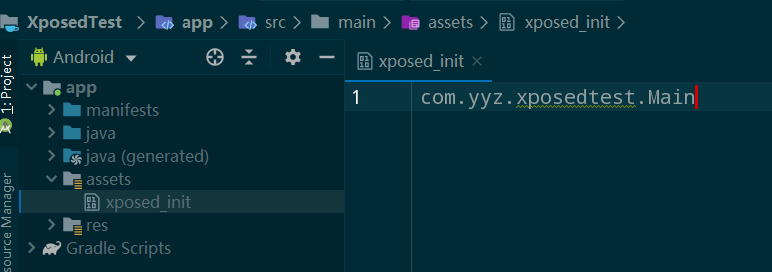

> 写博客是个好习惯，但是写的人水平参差不齐，我见过最搞笑的就是博文的内容是其他博客的链接。本着不误人子弟的原则，我写博客一向很克制。流水账系列是我平时的一些记录，是 `how to` 类型的文章，网上相关的资料一搜一大把，仅供自己记录查找。
>
> 本篇博客是记录一些学习 `Xposed`模块开发时知识的整理。

<!-- more -->

### 开发前的准备工作

查看 [Xposed-Framework-API](https://github.com/rovo89/XposedBridge/wiki/Using-the-Xposed-Framework-API) 根据文档进行配置

```java
repositories {
    jcenter();
}

dependencies {
    compileOnly 'de.robv.android.xposed:api:82'
}
```


`AndroidManifest.xml` 中 `application` 标签下加入

```java
<!-- 应用为模块 -->
<meta-data
    android:name="xposedmodule"
    android:value="true" />
<!-- 版本信息 该版本号与引用的依赖版本相同-->
<meta-data
    android:name="xposedminversion"
    android:value="82" />
<!-- 模块描述 -->
<meta-data
    android:name="xposeddescription"
    android:value="Xposed Test" />
```


创建 `Hook` 类，该类是 `Xposed` 的入口类，用于拦截加载的 `package` ，实现 `IXposedHookLoadPackage` 接口

```java
package com.yyz.xposedtest;
public class Main implements IXposedHookLoadPackage {
    @Override
    public void handleLoadPackage(XC_LoadPackage.LoadPackageParam lpparam) throws Throwable {
    	// TODO: hook逻辑  
    }
 }
```


在 `src/main` 目录下创建assets目录，在该目录中创建 `xposed_ini` t文件，写入上面创建的 `Xposed` 的入口类，如下：



### XposedHelpers 常用方法

### findAndHookMethod

> Look up a method and hook it. The last argument must be the callback for the hook.

最后一个参数主要有两种

`XC_MethodHook` 在原有方法逻辑上添加逻辑，代码如下

```java
//在原有方法逻辑上添加逻辑
/**
 * 1. 包名 2. classLoader 3. 方法名 4. 参数类型（没有则不添加） 5.Callback
 */
XposedHelpers.findAndHookMethod("cn.bcbook.kaixuetest.MainActivity",
        lpparam.classLoader, "printViewId", View.class, new XC_MethodHook() {
            @Override
            protected void beforeHookedMethod(MethodHookParam param) throws Throwable {
                super.beforeHookedMethod(param);
            }
            @Override
            protected void afterHookedMethod(MethodHookParam param) throws Throwable {
                super.afterHookedMethod(param);
                Log.i("yyz", "afterHookedMethod hook success!");
            }
        });
```


`XC_MethodReplacement` 替换原有方法逻辑，代码如下

```java
//替换原有方法
XposedHelpers.findAndHookMethod("cn.bcbook.kaixuetest.MainActivity",
        lpparam.classLoader, "printViewId", View.class, new XC_MethodReplacement() {
            @Override
            protected Object replaceHookedMethod(MethodHookParam param) throws Throwable {
                Log.i("yyz", "hook success!");
                return null;
            }
        });
```

