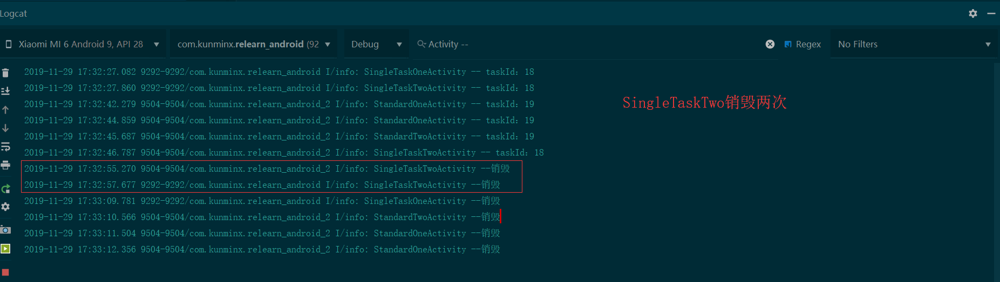
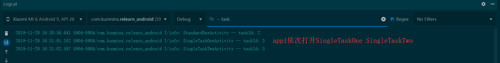
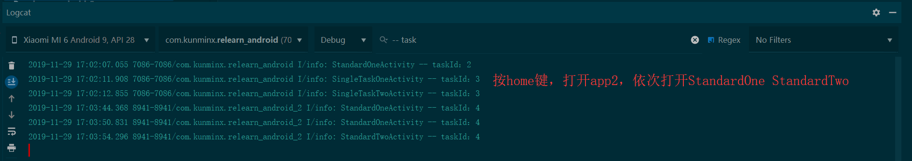
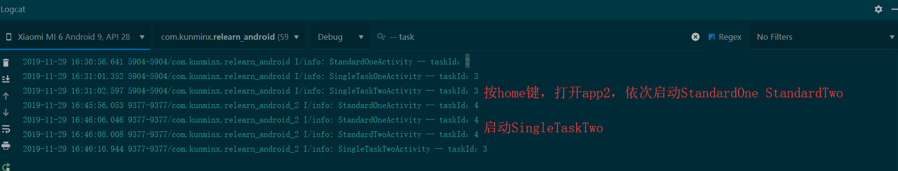
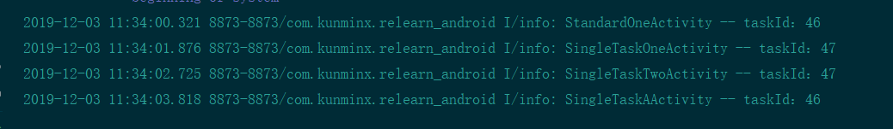
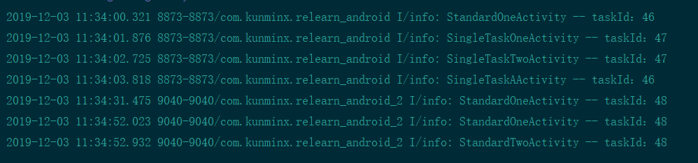
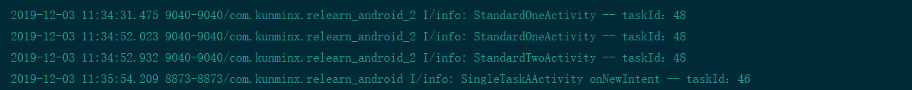
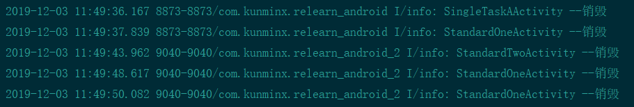

> 订阅 [重学安卓](https://xiaozhuanlan.com/topic/9074561823) 很久了，最近在整理读书笔记，在此记录之。
>
> 在此隆重推荐这位大佬 KunMinX
>
> 本文记录Activity任务栈与返回栈相关内容的疑问与探索

<!-- more -->

该专栏的代码地址： https://github.com/KunMinX/Relearn-Android 

#### 疑惑产生

根据大佬的代码以及文章描述，有个地方让我很疑惑。



我这里没有过滤当前使用的app，所以app1和app2产生的日志都显示了出来。

大佬在评论区关于此的回答

>
> [KunMinX](https://xiaozhuanlan.com/u/kunminx)
>
> \#40
>
> [#2楼](https://xiaozhuanlan.com/topic/7812045693#reply2) [*@*Sky63](https://xiaozhuanlan.com/u/2711412979)
> 大概明白你提到的、造成困扰的地方了。
> D 和 C 是由 app1 启动，在 IDE 中可通过 app1 的视角观察到。同理，当 app2 的 B 唤起 D 时，你在回退 D 的时候能在 app2 和 app1 的视角中同时观察到 D 的销毁。而紧随其后再回退一次， 便能在 app1 中观察到 C 被销毁。再下一次才轮到 app2 中 B 被销毁。

但是根据我操作看到的现象，D的销毁不是在不同app视角观察到的同一次销毁。通过上图可以看出两次销毁是有时间差的，而且经过我的二次确认，的确是关闭两次界面才出现了两次销毁Log。

#### 问题排查

通过 `adb shell` 中的 ` dumpsys activity activities` 命令可以查看 activity 栈信息，故我截取了相关的输出，以下堆栈信息均经过精简。

##### 1. `app1` 依次打开 `SingleTaskOne` `SingleTaskTwo`



```json
➜  Relearn-Android (master) adb shell
sagit:/ $ dumpsys activity activities
ACTIVITY MANAGER ACTIVITIES (dumpsys activity activities)
Display #0 (activities from top to bottom):

  Stack #2: type=standard mode=fullscreen
    Task id #3

    Running activities (most recent first):
      TaskRecord{4920da #3 A=com.kunminx.task.c U=0 StackId=2 sz=2}
        Run #1: ActivityRecord{93c0c72 u0 com.kunminx.relearn_android/com.kunminx.basicfacttesting.test03_task_test.SingleTaskTwoActivity t3}
        Run #0: ActivityRecord{999111 u0 com.kunminx.relearn_android/com.kunminx.basicfacttesting.test03_task_test.SingleTaskOneActivity t3}

    mResumedActivity: ActivityRecord{93c0c72 u0 com.kunminx.relearn_android/com.kunminx.basicfacttesting.test03_task_test.SingleTaskTwoActivity t3}
    mLastPausedActivity: ActivityRecord{999111 u0 com.kunminx.relearn_android/com.kunminx.basicfacttesting.test03_task_test.SingleTaskOneActivity t3}

  Stack #1: type=standard mode=fullscreen
    Task id #2

    Running activities (most recent first):
      TaskRecord{d91b3e8 #2 A=com.kunminx.relearn_android U=0 StackId=1 sz=2}
        Run #1: ActivityRecord{8b59240 u0 com.kunminx.relearn_android/com.kunminx.basicfacttesting.test03_task_test.StandardOneActivity t2}
        Run #0: ActivityRecord{d76e9a5 u0 com.kunminx.relearn_android/com.kunminx.basicfacttesting.TestMainActivity t2}

    mLastPausedActivity: ActivityRecord{8b59240 u0 com.kunminx.relearn_android/com.kunminx.basicfacttesting.test03_task_test.StandardOneActivity t2}

  Stack #0: type=home mode=fullscreen

    Task id #1

    Running activities (most recent first):
      TaskRecord{94a7a01 #1 I=com.miui.home/.launcher.Launcher U=0 StackId=0 sz=1}
        Run #0: ActivityRecord{7d6409 u0 com.miui.home/.launcher.Launcher t1}

    mLastPausedActivity: ActivityRecord{7d6409 u0 com.miui.home/.launcher.Launcher t1}

  ResumedActivity:ActivityRecord{
		93c0c72u0com.kunminx.relearn_android/com.kunminx.basicfacttesting.test03_task_test.SingleTaskTwoActivity t3}
  
  mFocusedStack=ActivityStack{
  		3a870a6 stackId=2 type=standard mode=fullscreen visible=true translucent=false, 1 tasks
  		} 
  mLastFocusedStack=ActivityStack{
  		3a870a6 stackId=2 type=standard mode=fullscreen visible=true translucent=false, 1 tasks
  		}
  mCurTaskIdForUser={0=3}
  mUserStackInFront={}
  displayId=0 stacks=3
   mHomeStack=ActivityStack{
   76ebae7 stackId=0 type=home mode=fullscreen visible=false translucent=true, 1 tasks
   }
  isHomeRecentsComponent=false  KeyguardController:
    mKeyguardShowing=false
    mAodShowing=false
    mKeyguardGoingAway=false
    mOccluded=false
    mDismissingKeyguardActivity=null
    mDismissalRequested=false
    mVisibilityTransactionDepth=0
  LockTaskController
    mLockTaskModeState=NONE
    mLockTaskModeTasks=
    mLockTaskPackages (userId:packages)=
      u0:[]

```

此时看到堆栈顺序为：**Stack #2 -< Stack #1 -< Stack #0** 其中 `Stack #0` 为 `launcher`

获取焦点的 `ActivityStack`：

```json
mFocusedStack=ActivityStack{
  		3a870a6 stackId=2 type=standard mode=fullscreen visible=true translucent=false, 1 tasks} 
mLastFocusedStack=ActivityStack{
  		3a870a6 stackId=2 type=standard mode=fullscreen visible=true translucent=false, 1 tasks}
```


##### 2. 按下HOME键，打开 `app2` 依次打开 `StandardOneActivity` `StandardTwoActivity`



```json
Display #0 (activities from top to bottom):

  Stack #3: type=standard mode=fullscreen
    Task id #4

    Running activities (most recent first):
      TaskRecord{718157f #4 A=com.kunminx.relearn_android_2 U=0 StackId=3 sz=4}
        Run #3: ActivityRecord{137a584 u0 com.kunminx.relearn_android_2/com.kunminx.basicfacttesting.test03_task_test.StandardTwoActivity t4}
        Run #2: ActivityRecord{648188e u0 com.kunminx.relearn_android_2/com.kunminx.basicfacttesting.test03_task_test.StandardOneActivity t4}
        Run #1: ActivityRecord{f39ebe9 u0 com.kunminx.relearn_android_2/com.kunminx.basicfacttesting.test03_task_test.StandardOneActivity t4}
        Run #0: ActivityRecord{f02fff8 u0 com.kunminx.relearn_android_2/com.kunminx.basicfacttesting.TestMainActivity t4}

    mResumedActivity: ActivityRecord{137a584 u0 com.kunminx.relearn_android_2/com.kunminx.basicfacttesting.test03_task_test.StandardTwoActivity t4}
    mLastPausedActivity: ActivityRecord{648188e u0 com.kunminx.relearn_android_2/com.kunminx.basicfacttesting.test03_task_test.StandardOneActivity t4}

  Stack #0: type=home mode=fullscreen
    Task id #1

    Running activities (most recent first):
      TaskRecord{2094d95 #1 I=com.miui.home/.launcher.Launcher U=0 StackId=0 sz=1}
        Run #0: ActivityRecord{a7fed1a u0 com.miui.home/.launcher.Launcher t1}

    mLastPausedActivity: ActivityRecord{a7fed1a u0 com.miui.home/.launcher.Launcher t1}

  Stack #2: type=standard mode=fullscreen
    Task id #3
    
    Running activities (most recent first):
      TaskRecord{9d79eaa #3 A=com.kunminx.task.c U=0 StackId=2 sz=2}
        Run #1: ActivityRecord{15d3e09 u0 com.kunminx.relearn_android/com.kunminx.basicfacttesting.test03_task_test.SingleTaskTwoActivity t3}
        Run #0: ActivityRecord{20d177c u0 com.kunminx.relearn_android/com.kunminx.basicfacttesting.test03_task_test.SingleTaskOneActivity t3}

    mLastPausedActivity: ActivityRecord{15d3e09 u0 com.kunminx.relearn_android/com.kunminx.basicfacttesting.test03_task_test.SingleTaskTwoActivity t3}

  Stack #1: type=standard mode=fullscreen
  isSleeping=false
  mBounds=Rect(0, 0 - 0, 0)

    Task id #2

    Running activities (most recent first):
      TaskRecord{e526e38 #2 A=com.kunminx.relearn_android U=0 StackId=1 sz=2}
        Run #1: ActivityRecord{19055b2 u0 com.kunminx.relearn_android/com.kunminx.basicfacttesting.test03_task_test.StandardOneActivity t2}
        Run #0: ActivityRecord{5a647a6 u0 com.kunminx.relearn_android/com.kunminx.basicfacttesting.TestMainActivity t2}

    mLastPausedActivity: ActivityRecord{19055b2 u0 com.kunminx.relearn_android/com.kunminx.basicfacttesting.test03_task_test.StandardOneActivity t2}

  ResumedActivity: ActivityRecord{137a584 u0 com.kunminx.relearn_android_2/com.kunminx.basicfacttesting.test03_task_test.StandardTwoActivity t4}

  mFocusedStack=ActivityStack{
      dfe2e11 stackId=3 type=standard mode=fullscreen visible=true translucent=false, 1 tasks} 
mLastFocusedStack=ActivityStack{
    dfe2e11 stackId=3 type=standard mode=fullscreen visible=true translucent=false, 1 tasks}
  mCurTaskIdForUser={0=4}
  mUserStackInFront={}
  displayId=0 stacks=4
   mHomeStack=ActivityStack{968fb76 stackId=0 type=home mode=fullscreen visible=false translucent=true, 1 tasks}
  isHomeRecentsComponent=false  KeyguardController:
    mKeyguardShowing=false
    mAodShowing=false
    mKeyguardGoingAway=false
    mOccluded=false
    mDismissingKeyguardActivity=null
    mDismissalRequested=false
    mVisibilityTransactionDepth=0
  LockTaskController
    mLockTaskModeState=NONE
    mLockTaskModeTasks=
    mLockTaskPackages (userId:packages)=
      u0:[]
      
```
**这里的堆栈顺序为 Stack #3 -< Stack #0 -< Stack #2 -< Stack #1**

`Stack #0` 为home ，这里反应出点击home键，打开app2 的操作。此时 `Stack #3` 中有 4 个 `ActivityRecord`

当前获取焦点的 `ActivityStack` 

```json
  mFocusedStack=ActivityStack{
      dfe2e11 stackId=3 type=standard mode=fullscreen visible=true translucent=false, 1 tasks} 
mLastFocusedStack=ActivityStack{
    dfe2e11 stackId=3 type=standard mode=fullscreen visible=true translucent=false, 1 tasks}
  mCurTaskIdForUser={0=4}
```


##### 3. 接下来启动 `SingleTaskTwoActivity`



```json
sagit:/ $ dumpsys activity activities
ACTIVITY MANAGER ACTIVITIES (dumpsys activity activities)
Display #0 (activities from top to bottom):

  Stack #2: type=standard mode=fullscreen
    Task id #3

    Running activities (most recent first):
      TaskRecord{4920da #3 A=com.kunminx.task.c U=0 StackId=2 sz=3}
        Run #2: ActivityRecord{55f799d u0 com.kunminx.relearn_android_2/com.kunminx.basicfacttesting.test03_task_test.SingleTaskTwoActivity t3}
        Run #1: ActivityRecord{93c0c72 u0 com.kunminx.relearn_android/com.kunminx.basicfacttesting.test03_task_test.SingleTaskTwoActivity t3}
        Run #0: ActivityRecord{999111 u0 com.kunminx.relearn_android/com.kunminx.basicfacttesting.test03_task_test.SingleTaskOneActivity t3}

    mResumedActivity: ActivityRecord{55f799d u0 com.kunminx.relearn_android_2/com.kunminx.basicfacttesting.test03_task_test.SingleTaskTwoActivity t3}

  Stack #3: type=standard mode=fullscreen
    Task id #4

    Running activities (most recent first):
      TaskRecord{f14a51a #4 A=com.kunminx.relearn_android_2 U=0 StackId=3 sz=4}
        Run #3: ActivityRecord{1838862 u0 com.kunminx.relearn_android_2/com.kunminx.basicfacttesting.test03_task_test.StandardTwoActivity t4}
        Run #2: ActivityRecord{bdb3180 u0 com.kunminx.relearn_android_2/com.kunminx.basicfacttesting.test03_task_test.StandardOneActivity t4}
        Run #1: ActivityRecord{7b21450 u0 com.kunminx.relearn_android_2/com.kunminx.basicfacttesting.test03_task_test.StandardOneActivity t4}
        Run #0: ActivityRecord{ff57abb u0 com.kunminx.relearn_android_2/com.kunminx.basicfacttesting.TestMainActivity t4}

    mLastPausedActivity: ActivityRecord{1838862 u0 com.kunminx.relearn_android_2/com.kunminx.basicfacttesting.test03_task_test.StandardTwoActivity t4}

  Stack #0: type=home mode=fullscreen
    Task id #1

    Running activities (most recent first):
      TaskRecord{94a7a01 #1 I=com.miui.home/.launcher.Launcher U=0 StackId=0 sz=1}
        Run #0: ActivityRecord{7d6409 u0 com.miui.home/.launcher.Launcher t1}

    mLastPausedActivity: ActivityRecord{7d6409 u0 com.miui.home/.launcher.Launcher t1}

  Stack #1: type=standard mode=fullscreen

    Task id #2
        
    Running activities (most recent first):
      TaskRecord{d91b3e8 #2 A=com.kunminx.relearn_android U=0 StackId=1 sz=2}
        Run #1: ActivityRecord{8b59240 u0 com.kunminx.relearn_android/com.kunminx.basicfacttesting.test03_task_test.StandardOneActivity t2}
        Run #0: ActivityRecord{d76e9a5 u0 com.kunminx.relearn_android/com.kunminx.basicfacttesting.TestMainActivity t2}

    mLastPausedActivity: ActivityRecord{8b59240 u0 com.kunminx.relearn_android/com.kunminx.basicfacttesting.test03_task_test.StandardOneActivity t2}

  ResumedActivity: ActivityRecord{55f799d u0 com.kunminx.relearn_android_2/com.kunminx.basicfacttesting.test03_task_test.SingleTaskTwoActivity t3}

  mFocusedStack=ActivityStack{
    3a870a6 stackId=2 type=standard mode=fullscreen visible=true translucent=false, 1 tasks} 
  mLastFocusedStack=ActivityStack{
    3a870a6 stackId=2 type=standard mode=fullscreen visible=true translucent=false, 1 tasks}
  mCurTaskIdForUser={0=4}

  mUserStackInFront={}
  displayId=0 stacks=4
   mHomeStack=ActivityStack{
       76ebae7 stackId=0 type=home mode=fullscreen visible=false translucent=true, 1 tasks}
  isHomeRecentsComponent=false  KeyguardController:
    mKeyguardShowing=false
    mAodShowing=false
    mKeyguardGoingAway=false
    mOccluded=false
    mDismissingKeyguardActivity=null
    mDismissalRequested=false
    mVisibilityTransactionDepth=0
  LockTaskController
    mLockTaskModeState=NONE
    mLockTaskModeTasks=
    mLockTaskPackages (userId:packages)=
      u0:[]

```
**当前的堆栈顺序 Stack #2 -< Stack #3 -< Stack #0 -<Stack #1**

当前获取焦点的 `ActivityStack` 
```json
  mFocusedStack=ActivityStack{
    3a870a6 stackId=2 type=standard mode=fullscreen visible=true translucent=false, 1 tasks} 
  mLastFocusedStack=ActivityStack{
    3a870a6 stackId=2 type=standard mode=fullscreen visible=true translucent=false, 1 tasks}
  mCurTaskIdForUser={0=4}
```

`Stack #2` 中 `TaskRecord`信息为

```json
      TaskRecord{4920da #3 A=com.kunminx.task.c U=0 StackId=2 sz=3}
        Run #2: ActivityRecord{55f799d u0 com.kunminx.relearn_android_2/com.kunminx.basicfacttesting.test03_task_test.SingleTaskTwoActivity t3}
        Run #1: ActivityRecord{93c0c72 u0 com.kunminx.relearn_android/com.kunminx.basicfacttesting.test03_task_test.SingleTaskTwoActivity t3}
        Run #0: ActivityRecord{999111 u0 com.kunminx.relearn_android/com.kunminx.basicfacttesting.test03_task_test.SingleTaskOneActivity t3}
```

#### 解惑

**关键的地方来了**

的确有两个 `SingleTaskTwoActivity` 的 `ActivityRecord` ，栈顶的属于 `app2` 第二个属于 `app1`

由此看出这两个`ActivityRecord` 不是一个实例，所以这里 `app2` 启动的 `SingleTaskTwoActivity` 应该是 `app2` 自己的activity

废话不说，翻代码！这里截取了 `BaseTaskActivity` 中的部分代码，`app1` 和 `app2`中的 `activity` 都继承了`BaseTaskActivity` 

```java
@Override
    public void onClick(View v) {
        int i = v.getId();
        if (i == R.id.btn_standard_one) {
            Intent intent = new Intent(this, StandardOneActivity.class);
            startActivityWithCheck(intent);

        } else if (i == R.id.btn_standard_two) {
            Intent intent = new Intent(this, StandardTwoActivity.class);
            startActivityWithCheck(intent);

        } else if (i == R.id.btn_singletask_one) {
            Intent intent = new Intent(this, SingleTaskOneActivity.class);
            startActivityWithCheck(intent);

        } else if (i == R.id.btn_singletask_two) {
            Intent intent = new Intent(this, SingleTaskTwoActivity.class);
            startActivityWithCheck(intent);

            //以下测试结果证实：
            //1.在 App2 中启动 App1 的 standard Activity，仍然遵守 standard 的特点：在启动它的 Activity 所在的任务中启动，也即跟随 App2。
            //2.在 App2 中启动 App1 的 singleTop Activity，跟随状况同 standard。
            //3.在 App2 中启动 App1 的 singleTask Activity，仍然处于 App1 的任务中，并不跟随 App2。
        } else if (i == R.id.btn_singletask_a) {
            Intent intent = new Intent();
            ComponentName name = new ComponentName(
                    "com.kunminx.relearn_android",
                    "com.kunminx.relearn_android.SingleTaskAActivity");
            intent.setComponent(name);
            startActivityWithCheck(intent);

        } else if (i == R.id.btn_singletask_b) {
            Intent intent = new Intent();
            ComponentName name = new ComponentName(
                    "com.kunminx.relearn_android",
                    "com.kunminx.relearn_android.SingleTaskBActivity");
            intent.setComponent(name);
            startActivityWithCheck(intent);

        }
```


可以看出这里 `app2` 启动`SingleTaskTwoActivity` 的确是自己的 `activity`

**那么它为什么和`app1` 中的  `SingleTaskTwoActivity`  是同一个 `TaskRecord` 呢？**

```xml
        <activity
            android:name=".test03_task_test.SingleTaskOneActivity"
            android:launchMode="singleTask"
            android:taskAffinity="com.kunminx.task.c" />
        <activity
            android:name=".test03_task_test.SingleTaskTwoActivity"
            android:launchMode="singleTask"
            android:taskAffinity="com.kunminx.task.c" />
```

它们有着共同的 `taskAffinity`。至此，我的疑惑已经得到了答案。

#### 拓展

我试了以下 `app2` 中启动 `app1` 中的Activity的情况

`app1` 依次启动 `StandardOneActivity` -< `SingleTaskOneActivity`  -< `SingleTaskTwoActivity`  -< ` SingleTaskAActivity`

其中 `SingleTaskOneActivity`  与 `SingleTaskTwoActivity` 设置了相同的 `taskAffinity` ,`StandardOneActivity` ` 与 SingleTaskAActivity` 未设置 `taskAffinity`



接着按 HOME 键，打开 `app2` ，依次打开 `StandardOneActivity` -< `StandardOneActivity` -< `StandardTwoActivity`



此时堆栈信息

```json
➜  Relearn-Android (master) adb shell
sagit:/ $ dumpsys activity activities
ACTIVITY MANAGER ACTIVITIES (dumpsys activity activities)
Display #0 (activities from top to bottom):

  Stack #3: type=standard mode=fullscreen
  isSleeping=false
  mBounds=Rect(0, 0 - 0, 0)
    Task id #48

    Running activities (most recent first):
      TaskRecord{3b07175 #48 A=com.kunminx.relearn_android_2 U=0 StackId=3 sz=4}
        Run #3: ActivityRecord{9cdafc6 u0 com.kunminx.relearn_android_2/com.kunminx.basicfacttesting.test03_task_test.StandardTwoActivity t48}
        Run #2: ActivityRecord{83db884 u0 com.kunminx.relearn_android_2/com.kunminx.basicfacttesting.test03_task_test.StandardOneActivity t48}
        Run #1: ActivityRecord{71254 u0 com.kunminx.relearn_android_2/com.kunminx.basicfacttesting.test03_task_test.StandardOneActivity t48}
        Run #0: ActivityRecord{7c135cf u0 com.kunminx.relearn_android_2/com.kunminx.basicfacttesting.TestMainActivity t48}

    mResumedActivity: ActivityRecord{9cdafc6 u0 com.kunminx.relearn_android_2/com.kunminx.basicfacttesting.test03_task_test.StandardTwoActivity t48}
    mLastPausedActivity: ActivityRecord{83db884 u0 com.kunminx.relearn_android_2/com.kunminx.basicfacttesting.test03_task_test.StandardOneActivity t48}

  Stack #0: type=home mode=fullscreen
    Running activities (most recent first):
      TaskRecord{185017b #1 I=com.miui.home/.launcher.Launcher U=0 StackId=0 sz=1}
        Run #0: ActivityRecord{9fd4f88 u0 com.miui.home/.launcher.Launcher t1}

    mLastPausedActivity: ActivityRecord{9fd4f88 u0 com.miui.home/.launcher.Launcher t1}

  Stack #1: type=standard mode=fullscreen
    Task id #46
    Running activities (most recent first):
      TaskRecord{c374b98 #46 A=com.kunminx.relearn_android U=0 StackId=1 sz=3}
        Run #2: ActivityRecord{5afc3da u0 com.kunminx.relearn_android/.SingleTaskAActivity t46}
        Run #1: ActivityRecord{bb0363c u0 com.kunminx.relearn_android/com.kunminx.basicfacttesting.test03_task_test.StandardOneActivity t46}
        Run #0: ActivityRecord{510711c u0 com.kunminx.relearn_android/com.kunminx.basicfacttesting.TestMainActivity t46}

    mLastPausedActivity: ActivityRecord{5afc3da u0 com.kunminx.relearn_android/.SingleTaskAActivity t46}

  Stack #2: type=standard mode=fullscreen
    Task id #47
    Running activities (most recent first):
      TaskRecord{3387d6 #47 A=com.kunminx.task.c U=0 StackId=2 sz=2}
        Run #1: ActivityRecord{6375a1b u0 com.kunminx.relearn_android/com.kunminx.basicfacttesting.test03_task_test.SingleTaskTwoActivity t47}
        Run #0: ActivityRecord{e9850ca u0 com.kunminx.relearn_android/com.kunminx.basicfacttesting.test03_task_test.SingleTaskOneActivity t47}

    mLastPausedActivity: ActivityRecord{6375a1b u0 com.kunminx.relearn_android/com.kunminx.basicfacttesting.test03_task_test.SingleTaskTwoActivity t47}

  ResumedActivity: ActivityRecord{9cdafc6 u0 com.kunminx.relearn_android_2/com.kunminx.basicfacttesting.test03_task_test.StandardTwoActivity t48}

  mFocusedStack=ActivityStack{ed83a57 stackId=3 type=standard mode=fullscreen visible=true translucent=false, 1 tasks}
  mLastFocusedStack=ActivityStack{ed83a57 stackId=3 type=standard mode=fullscreen visible=true translucent=false, 1 tasks}
  mCurTaskIdForUser={0=48}

  mUserStackInFront={}
  displayId=0 stacks=4
   mHomeStack=ActivityStack{a218944 stackId=0 type=home mode=fullscreen visible=false translucent=true, 1 tasks}
  isHomeRecentsComponent=false  KeyguardController:
    mKeyguardShowing=false
    mAodShowing=false
    mKeyguardGoingAway=false
    mOccluded=false
    mDismissingKeyguardActivity=null
    mDismissalRequested=false
    mVisibilityTransactionDepth=0
  LockTaskController
    mLockTaskModeState=NONE
    mLockTaskModeTasks=
    mLockTaskPackages (userId:packages)=
      u0:[]
```


最后在 `app2` 中启动  `app1` 的 `SingleTaskAActivity` 



此时堆栈信息

```json
➜  Relearn-Android (master) adb shell
sagit:/ $ dumpsys activity activities
ACTIVITY MANAGER ACTIVITIES (dumpsys activity activities)
Display #0 (activities from top to bottom):

  Stack #1: type=standard mode=fullscreen
    Task id #46
    Running activities (most recent first):
      TaskRecord{c374b98 #46 A=com.kunminx.relearn_android U=0 StackId=1 sz=3}
        Run #2: ActivityRecord{5afc3da u0 com.kunminx.relearn_android/.SingleTaskAActivity t46}
        Run #1: ActivityRecord{bb0363c u0 com.kunminx.relearn_android/com.kunminx.basicfacttesting.test03_task_test.StandardOneActivity t46}
        Run #0: ActivityRecord{510711c u0 com.kunminx.relearn_android/com.kunminx.basicfacttesting.TestMainActivity t46}

    mResumedActivity: ActivityRecord{5afc3da u0 com.kunminx.relearn_android/.SingleTaskAActivity t46}

  Stack #3: type=standard mode=fullscreen
    Task id #48
    Running activities (most recent first):
      TaskRecord{3b07175 #48 A=com.kunminx.relearn_android_2 U=0 StackId=3 sz=4}
        Run #3: ActivityRecord{9cdafc6 u0 com.kunminx.relearn_android_2/com.kunminx.basicfacttesting.test03_task_test.StandardTwoActivity t48}
        Run #2: ActivityRecord{83db884 u0 com.kunminx.relearn_android_2/com.kunminx.basicfacttesting.test03_task_test.StandardOneActivity t48}
        Run #1: ActivityRecord{71254 u0 com.kunminx.relearn_android_2/com.kunminx.basicfacttesting.test03_task_test.StandardOneActivity t48}
        Run #0: ActivityRecord{7c135cf u0 com.kunminx.relearn_android_2/com.kunminx.basicfacttesting.TestMainActivity t48}

    mLastPausedActivity: ActivityRecord{9cdafc6 u0 com.kunminx.relearn_android_2/com.kunminx.basicfacttesting.test03_task_test.StandardTwoActivity t48}

  Stack #0: type=home mode=fullscreen
    Task id #1
    Running activities (most recent first):
      TaskRecord{185017b #1 I=com.miui.home/.launcher.Launcher U=0 StackId=0 sz=1}
        Run #0: ActivityRecord{9fd4f88 u0 com.miui.home/.launcher.Launcher t1}

    mLastPausedActivity: ActivityRecord{9fd4f88 u0 com.miui.home/.launcher.Launcher t1}

  Stack #2: type=standard mode=fullscreen
    Task id #47
    Running activities (most recent first):
      TaskRecord{3387d6 #47 A=com.kunminx.task.c U=0 StackId=2 sz=2}
        Run #1: ActivityRecord{6375a1b u0 com.kunminx.relearn_android/com.kunminx.basicfacttesting.test03_task_test.SingleTaskTwoActivity t47}
        Run #0: ActivityRecord{e9850ca u0 com.kunminx.relearn_android/com.kunminx.basicfacttesting.test03_task_test.SingleTaskOneActivity t47}

    mLastPausedActivity: ActivityRecord{6375a1b u0 com.kunminx.relearn_android/com.kunminx.basicfacttesting.test03_task_test.SingleTaskTwoActivity t47}

  ResumedActivity: ActivityRecord{5afc3da u0 com.kunminx.relearn_android/.SingleTaskAActivity t46}

  mFocusedStack=ActivityStack{50922c2 stackId=1 type=standard mode=fullscreen visible=true translucent=false, 1 tasks}
  mLastFocusedStack=ActivityStack{50922c2 stackId=1 type=standard mode=fullscreen visible=true translucent=false, 1 tasks}

  mCurTaskIdForUser={0=48}
  mUserStackInFront={}
  displayId=0 stacks=4
   mHomeStack=ActivityStack{a218944 stackId=0 type=home mode=fullscreen visible=false translucent=true, 1 tasks}
  isHomeRecentsComponent=false  KeyguardController:
    mKeyguardShowing=false
    mAodShowing=false
    mKeyguardGoingAway=false
    mOccluded=false
    mDismissingKeyguardActivity=null
    mDismissalRequested=false
    mVisibilityTransactionDepth=0
  LockTaskController
    mLockTaskModeState=NONE
    mLockTaskModeTasks=
    mLockTaskPackages (userId:packages)=
      u0:[]
```

此时 `app1` 的 `taskid` 46 的`TaskRecord` 转移到了 栈顶

接下来返回销毁的逻辑就很清晰了。



最后退到 `launcher` 界面

**`app1` 的 `TaskRecord` 转移到了 `app2` 的返回栈中**