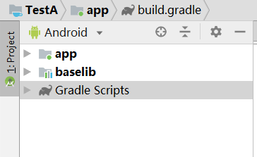
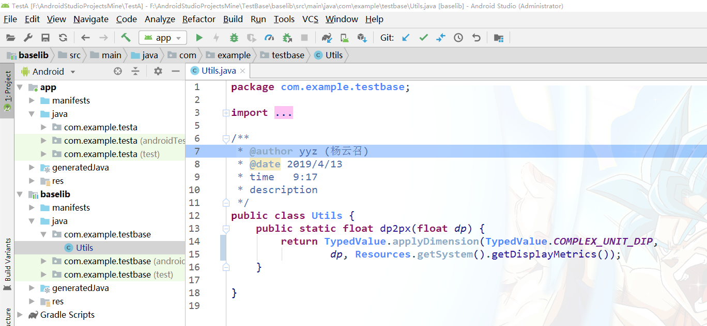
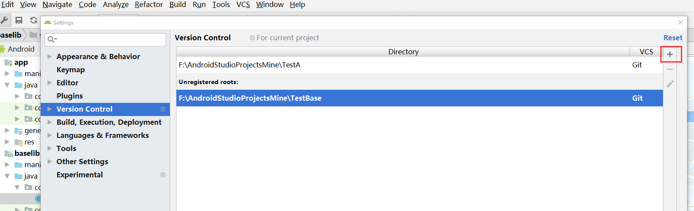
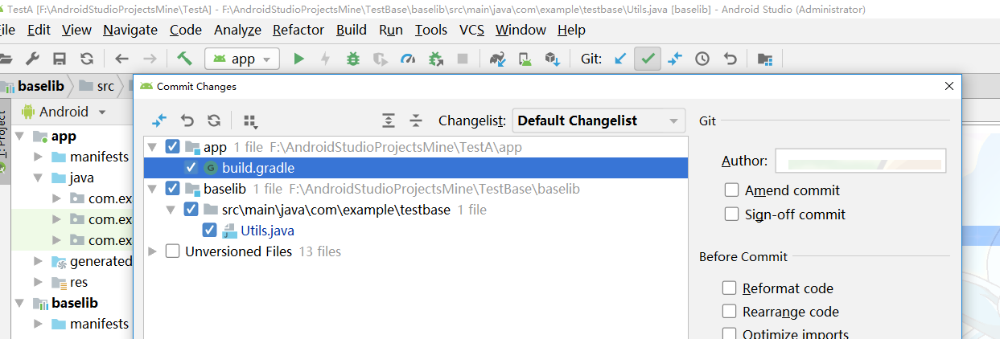
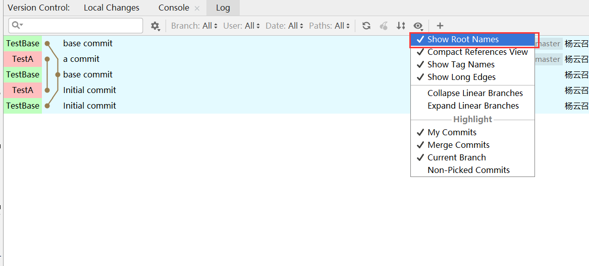

> android Studio  中的项目在正常引用module的时候是用复制到项目中的方式进行，单个项目调用还能适用，但是如果多个项目要引用同一个module的时候，如果module中进行了修改，那么每个项目中的module都要进行修改，这样增加了工作量，并且容易出现bug
>
> 因此我们需要引用module ，而不是复制module，实现方法如下

<!-- more -->

新建项目 `TestBase`，在其 `app build.gradle` 中将 `apply plugin: 'com.android.application'` 改为`apply plugin: 'com.android.library'` 删除`applicationId` 配置项，将`module`名修改为`baselib`。

新建项目 `TestA` 在其`settings.gradle` 文件中加入下列代码。

```gradle
include ':app'
include ':baselib'
project(':baselib').projectDir=new File("../TestBase", 'baselib')
```

引用依赖时正常引用即可

```
implementation project(':baselib')
```

同步`gradle` ，此时我们发现`baselib`出现在`TestA`项目中。



打开`TestA` 项目文件夹，我们发现了 `baselib` 文件夹，下面只有一个`baselib.iml`文件


在`baselib`中加入`Utils` 工具类



切换到`TestBase`中查看，代码是相同的。


这样就达到了`baselib`被修改后所有引用`baselib`的项目会同步变化。

#### git 同步管理

> 上述操作都是基于本地的，那么如何加入git管理呢

将`TestA`和`TestBase`分别传至`github`

在`TestA`项目中打开`settings`，找到如下位置并将`TestBase`加入到`git`管理



然后就可以同步管理这两个项目啦



参考：
[https://www.jianshu.com/p/47156a6be8ce](https://www.jianshu.com/p/47156a6be8ce)
[https://blog.csdn.net/saintcs/article/details/78567612